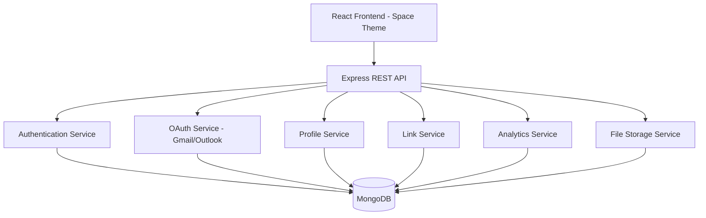

# Design Document - Social Link Hub

## Overview

Social Link Hub is a fullstack web application that enables users to create personalized landing pages containing their social media links and other important URLs. The platform features a space-themed UI, OAuth authentication, comprehensive security measures, and analytics tracking. Built with Node.js/Express backend, React frontend, and MongoDB database.

## Architecture

### System Architecture



### Technology Stack

- **Frontend**: React 18, React Router, Axios, CSS3 (Space Theme)
- **Backend**: Node.js, Express.js, Passport.js (OAuth)
- **Database**: MongoDB with Mongoose ODM
- **Authentication**: JWT tokens, bcrypt, Passport OAuth2
- **Security**: Helmet, express-rate-limit, express-validator, DOMPurify
- **File Upload**: Multer with file validation
- **Testing**: Jest, React Testing Library, Supertest

### Deployment Architecture

- Frontend: Static hosting (Vercel/Netlify)
- Backend: Node.js server (Railway/Render)
- Database: MongoDB Atlas
- File Storage: Cloud storage or local filesystem

## Components and Interfaces

### Frontend Components

#### 1. Authentication Components
- `LoginPage`: Email/password and OAuth login
- `RegisterPage`: User registration form
- `OAuthCallback`: OAuth redirect handler
- `PasswordResetRequest`: Password reset request form
- `PasswordResetForm`: New password submission

#### 2. Dashboard Components
- `Dashboard`: Main user dashboard
- `ProfileEditor`: Edit profile information
- `LinkManager`: Add, edit, delete, reorder links
- `LinkItem`: Individual link component with toggle
- `Analytics`: Display statistics
- `UsernameEditor`: Change username

#### 3. Public Profile Components
- `PublicProfile`: Space-themed public profile view
- `LinkButton`: Clickable link with space styling
- `ProfileHeader`: Profile picture, name, bio

#### 4. Shared Components
- `SpaceBackground`: Animated space background
- `StarField`: Particle effects
- `LoadingSpinner`: Space-themed loader
- `ErrorBoundary`: Error handling

### Backend API Endpoints

#### Authentication Endpoints
```
POST   /api/auth/register          - Register new user
POST   /api/auth/login             - Login with credentials
POST   /api/auth/logout            - Logout user
GET    /api/auth/me                - Get current user
POST   /api/auth/password-reset    - Request password reset
POST   /api/auth/password-reset/:token - Reset password
GET    /api/auth/google            - Google OAuth initiation
GET    /api/auth/google/callback   - Google OAuth callback
GET    /api/auth/microsoft         - Microsoft OAuth initiation
GET    /api/auth/microsoft/callback - Microsoft OAuth callback
```

#### Profile Endpoints
```
GET    /api/profile/:username      - Get public profile
PUT    /api/profile                - Update profile
PUT    /api/profile/username       - Change username
POST   /api/profile/picture        - Upload profile picture
PUT    /api/profile/theme          - Update theme color
```

#### Link Endpoints
```
GET    /api/links                  - Get user's links
POST   /api/links                  - Create new link
PUT    /api/links/:id              - Update link
DELETE /api/links/:id              - Delete link
PUT    /api/links/reorder          - Reorder links
PUT    /api/links/:id/toggle       - Toggle link active status
```

#### Analytics Endpoints
```
GET    /api/analytics              - Get user analytics
POST   /api/analytics/view/:username - Increment profile view
POST   /api/analytics/click/:linkId  - Increment link click
```

### Service Layer

#### AuthService
- `register(email, username, password)`: Create new user
- `login(email, password)`: Authenticate user
- `validateToken(token)`: Verify JWT token
- `generateResetToken(email)`: Create password reset token
- `resetPassword(token, newPassword)`: Update password
- `handleOAuthCallback(provider, profile)`: Process OAuth login

#### ProfileService
- `getProfile(username)`: Retrieve public profile
- `updateProfile(userId, data)`: Update profile information
- `changeUsername(userId, newUsername)`: Update username
- `uploadProfilePicture(userId, file)`: Handle image upload
- `updateTheme(userId, color)`: Save theme preference

#### LinkService
- `getLinks(userId)`: Get all user links
- `createLink(userId, title, url)`: Add new link
- `updateLink(linkId, data)`: Modify link
- `deleteLink(linkId)`: Remove link
- `reorderLinks(userId, linkIds)`: Update link order
- `toggleLinkStatus(linkId)`: Activate/deactivate link

#### AnalyticsService
- `getAnalytics(userId)`: Retrieve user statistics
- `incrementProfileView(username)`: Update view count
- `incrementLinkClick(linkId)`: Update click count

## Data Models

### User Model
```javascript
{
  _id: ObjectId,
  email: String (unique, required),
  username: String (unique, required, lowercase),
  password: String (hashed, optional for OAuth users),
  name: String,
  bio: String (max 200 chars),
  profilePicture: String (URL or path),
  themeColor: String (hex color, default: '#6B46C1'),
  oauthProvider: String (enum: ['local', 'google', 'microsoft']),
  oauthId: String,
  failedLoginAttempts: Number (default: 0),
  lockUntil: Date,
  createdAt: Date,
  updatedAt: Date
}
```

### Link Model
```javascript
{
  _id: ObjectId,
  userId: ObjectId (ref: User),
  title: String (required, max 100 chars),
  url: String (required, validated URL),
  position: Number (for ordering),
  isActive: Boolean (default: true),
  clicks: Number (default: 0),
  createdAt: Date,
  updatedAt: Date
}
```

### Analytics Model
```javascript
{
  _id: ObjectId,
  userId: ObjectId (ref: User),
  profileViews: Number (default: 0),
  lastViewedAt: Date,
  createdAt: Date,
  updatedAt: Date
}
```

### PasswordReset Model
```javascript
{
  _id: ObjectId,
  userId: ObjectId (ref: User),
  token: String (hashed),
  expiresAt: Date,
  used: Boolean (default: false),
  createdAt: Date
}
```

### Session Model (JWT-based)
```javascript
{
  userId: ObjectId,
  email: String,
  username: String,
  iat: Number (issued at),
  exp: Number (expiration)
}
```

## Correctness Properties


*A property is a characteristic or behavior that should hold true across all valid executions of a system-essentially, a formal statement about what the system should do. Properties serve as the bridge between human-readable specifications and machine-verifiable correctness guarantees.*

### Authentication & Registration Properties

Property 1: User registration creates account
*For any* valid email, username, and password combination, registration should successfully create a user account in the database
**Validates: Requirements 1.1**

Property 2: Short URL generation
*For any* completed user registration, the system should create a unique short URL that matches the username
**Validates: Requirements 1.4**

Property 3: Password hashing
*For any* password stored in the database, the stored value should differ from the plaintext input (passwords must be hashed)
**Validates: Requirements 1.5**

Property 4: Authentication with valid credentials
*For any* user with valid credentials, login should succeed and create a session
**Validates: Requirements 2.1**

Property 5: Dashboard redirect after login
*For any* successful login, the user should be redirected to the profile management dashboard
**Validates: Requirements 2.3**

Property 6: OAuth token exchange
*For any* valid OAuth authorization code, the system should successfully exchange it for an OAuth token
**Validates: Requirements 14.2**

Property 7: OAuth email extraction
*For any* valid OAuth token, the system should successfully retrieve the user's email address
**Validates: Requirements 14.3**

Property 8: OAuth new user creation
*For any* first-time OAuth login, the system should create a new user account with the OAuth email
**Validates: Requirements 14.4**

Property 9: OAuth existing user login
*For any* OAuth login with an existing email, the system should authenticate the user and create a session
**Validates: Requirements 14.5**

### Link Management Properties

Property 10: Link creation with validation
*For any* valid title and URL, the system should save the link to the database associated with the user
**Validates: Requirements 3.1, 3.4**

Property 11: Invalid URL rejection
*For any* malformed or invalid URL, the system should reject the link creation
**Validates: Requirements 3.3**

Property 12: Link ordering preservation
*For any* set of user links, they should be displayed in the order they were created
**Validates: Requirements 3.5**

Property 13: Link update with validation
*For any* valid link update data, the system should validate and persist the changes to the database
**Validates: Requirements 4.1**

Property 14: Link deletion completeness
*For any* link deletion request, the link should be completely removed from the database
**Validates: Requirements 4.2**

Property 15: Link reordering persistence
*For any* link reordering operation, the new order should be saved to the database
**Validates: Requirements 4.3**

Property 16: Reordering data preservation
*For any* link reordering operation, all link data (title, URL, clicks) should remain unchanged, only position values should update
**Validates: Requirements 4.4**

### Profile Management Properties

Property 17: Profile updates persistence
*For any* valid profile name or bio update, the changes should be saved to the database
**Validates: Requirements 5.1**

Property 18: Profile picture validation
*For any* profile picture upload, the system should validate image format and size before accepting
**Validates: Requirements 5.2**

Property 19: Theme color persistence
*For any* theme color selection, the preference should be saved to the database
**Validates: Requirements 5.3**

Property 20: Profile changes immediate visibility
*For any* profile update, the changes should immediately appear on the public profile page
**Validates: Requirements 5.4**

### Public Profile & Analytics Properties

Property 21: Short URL profile retrieval
*For any* valid short URL, the system should retrieve and display the corresponding user profile
**Validates: Requirements 6.1**

Property 22: Profile display completeness
*For any* displayed profile, it should show profile picture, name, bio, and all active links
**Validates: Requirements 6.3**

Property 23: Link click tracking and redirect
*For any* link click, the system should both redirect to the target URL and increment the click counter
**Validates: Requirements 6.4**

Property 24: Profile view counter increment
*For any* profile access, the view counter should be incremented in the database
**Validates: Requirements 6.5**

Property 25: Analytics display accuracy
*For any* user viewing their dashboard, the system should display accurate profile views and link click counts from the database
**Validates: Requirements 7.1, 7.2**

Property 26: Atomic click counter increment
*For any* link click, the click counter should increment by exactly 1 atomically
**Validates: Requirements 7.3**

Property 27: Atomic view counter increment
*For any* profile view, the view counter should increment by exactly 1 atomically
**Validates: Requirements 7.4**

### Link Visibility Properties

Property 28: Inactive link status update
*For any* link toggled to inactive, the status should be updated in the database
**Validates: Requirements 8.1**

Property 29: Inactive link public exclusion
*For any* inactive link, it should not appear on the public profile page
**Validates: Requirements 8.2**

Property 30: Active link public inclusion
*For any* link toggled to active, it should appear on the public profile page
**Validates: Requirements 8.3**

Property 31: Inactive link dashboard visibility
*For any* inactive link, it should still be visible in the user's dashboard with inactive status indicator
**Validates: Requirements 8.4**

### Username Management Properties

Property 32: Username uniqueness validation
*For any* username change attempt, the system should validate that the new username is not already taken
**Validates: Requirements 9.1**

Property 33: Short URL update on username change
*For any* username change, the short URL should be updated to reflect the new username
**Validates: Requirements 9.2**

Property 34: Username database update
*For any* username change, the user record in the database should be updated
**Validates: Requirements 9.3**

### Error Handling Properties

Property 35: Database error handling
*For any* database operation failure, the system should log the error and return an appropriate error message to the user
**Validates: Requirements 10.2**

### Security Properties

Property 36: Account lockout after failed attempts
*For any* user with multiple consecutive failed login attempts, the account should be temporarily locked
**Validates: Requirements 11.1**

Property 37: Input sanitization
*For any* user input received, the system should sanitize it to prevent injection attacks
**Validates: Requirements 11.2**

Property 38: Output escaping for XSS prevention
*For any* user-generated content displayed, the system should escape output to prevent XSS attacks
**Validates: Requirements 11.3**

Property 39: CSRF token validation
*For any* state-changing API request, the system should validate CSRF tokens
**Validates: Requirements 11.4**

Property 40: Secure session cookies
*For any* session creation, cookies should be set with httpOnly and secure flags
**Validates: Requirements 11.5**

### Password Reset Properties

Property 41: Reset token generation
*For any* password reset request, the system should generate a unique, time-limited token
**Validates: Requirements 12.1**

Property 42: Reset token hashing
*For any* generated reset token, it should be stored as a hash in the database with expiration time
**Validates: Requirements 12.2**

Property 43: Password reset and token invalidation
*For any* valid reset token submission with new password, the password should be updated and the token invalidated
**Validates: Requirements 12.3**

Property 44: Expired token rejection
*For any* expired reset token, password reset attempts should be rejected
**Validates: Requirements 12.4**

Property 45: Session invalidation on password reset
*For any* completed password reset, all existing sessions for that user should be invalidated
**Validates: Requirements 12.5**

### API Security Properties

Property 46: Authentication verification
*For any* protected API endpoint, the system should verify a valid session before processing the request
**Validates: Requirements 13.1**

Property 47: Authorization verification
*For any* data access attempt, the system should verify ownership and reject unauthorized access
**Validates: Requirements 13.2**

Property 48: Rate limit enforcement
*For any* API request that exceeds rate limits, the system should reject the request with appropriate error code
**Validates: Requirements 13.3**

Property 49: File upload validation
*For any* file upload, the system should validate file type, size, and scan for malicious content
**Validates: Requirements 13.4**

## Error Handling

### Error Categories

1. **Validation Errors** (400 Bad Request)
   - Invalid email format
   - Invalid URL format
   - Missing required fields
   - Invalid file type/size
   - Username/email already exists

2. **Authentication Errors** (401 Unauthorized)
   - Invalid credentials
   - Expired session
   - Invalid JWT token
   - Account locked

3. **Authorization Errors** (403 Forbidden)
   - Accessing another user's data
   - CSRF token validation failure

4. **Not Found Errors** (404 Not Found)
   - Profile not found
   - Link not found
   - Invalid short URL

5. **Rate Limit Errors** (429 Too Many Requests)
   - Too many login attempts
   - API rate limit exceeded

6. **Server Errors** (500 Internal Server Error)
   - Database connection failure
   - File upload failure
   - OAuth provider errors

### Error Response Format
```javascript
{
  success: false,
  error: {
    code: 'ERROR_CODE',
    message: 'Human-readable error message',
    details: {} // Optional additional context
  }
}
```

### Error Handling Strategy

- All errors should be logged with appropriate severity levels
- Sensitive information should never be exposed in error messages
- Database errors should be caught and transformed into user-friendly messages
- OAuth errors should provide retry mechanisms
- File upload errors should specify what went wrong (size, type, etc.)
- Rate limit errors should include retry-after information

## Testing Strategy

### Unit Testing

Unit tests will verify specific functionality and edge cases:

- **Authentication**: Test login/register with various input combinations
- **Validation**: Test URL validation, email validation, file validation
- **Link Operations**: Test CRUD operations on links
- **Profile Operations**: Test profile updates and username changes
- **Error Handling**: Test error responses for invalid inputs
- **Security**: Test password hashing, token generation, sanitization

### Property-Based Testing

Property-based tests will verify universal properties across many random inputs using **fast-check** library for JavaScript:

- Each property-based test will run a minimum of 100 iterations
- Tests will use generators to create random valid and invalid inputs
- Each test will be tagged with: `**Feature: social-link-hub, Property {number}: {property_text}**`
- Each correctness property will be implemented by a single property-based test

**Property Test Examples:**

1. **Password Hashing Property**: Generate random passwords, verify stored hash differs from input
2. **Link Ordering Property**: Generate random link sets, verify display order matches creation order
3. **Reordering Invariant**: Generate random reorder operations, verify link data unchanged
4. **Atomic Counter Property**: Simulate concurrent clicks, verify final count equals number of clicks
5. **Input Sanitization Property**: Generate strings with injection attempts, verify sanitization occurs
6. **URL Validation Property**: Generate random URLs (valid and invalid), verify correct acceptance/rejection

### Integration Testing

- Test complete user flows (register → login → add links → view profile)
- Test OAuth flows with mock providers
- Test database operations with test database
- Test file upload with various file types
- Test rate limiting with multiple requests

### Security Testing

- Test SQL/NoSQL injection attempts
- Test XSS attack vectors
- Test CSRF protection
- Test rate limiting effectiveness
- Test session security
- Test file upload security

### Frontend Testing

- Component unit tests with React Testing Library
- User interaction tests
- Space theme rendering tests
- Responsive design tests
- Accessibility tests

## Space Theme UI Design

### Visual Design Elements

- **Background**: Animated starfield with twinkling stars and nebula effects
- **Color Palette**: 
  - Primary: Deep space purple (#6B46C1)
  - Secondary: Cosmic blue (#4299E1)
  - Accent: Stellar gold (#F6AD55)
  - Background: Dark space (#0F0F23)
  - Text: Bright white (#FFFFFF)

- **Components**:
  - Glassmorphism cards with subtle glow effects
  - Floating animation for link buttons
  - Particle effects on hover
  - Smooth transitions and animations
  - Gradient borders with cosmic colors

- **Typography**: Modern sans-serif fonts with good readability
- **Icons**: Space-themed icons (rockets, stars, planets)
- **Animations**: Subtle floating, pulsing, and glow effects

### Responsive Design

- Mobile-first approach
- Breakpoints: 320px, 768px, 1024px, 1440px
- Touch-friendly button sizes
- Optimized animations for mobile performance

## Performance Considerations

- Database indexing on username, email, userId fields
- Caching for public profiles
- Image optimization and compression
- Lazy loading for profile pictures
- Debouncing for search/filter operations
- Connection pooling for MongoDB
- Rate limiting to prevent abuse
- CDN for static assets

## Deployment & Configuration

### Environment Variables

```
NODE_ENV=production
PORT=5000
MONGODB_URI=mongodb+srv://...
JWT_SECRET=...
JWT_EXPIRE=7d
GOOGLE_CLIENT_ID=...
GOOGLE_CLIENT_SECRET=...
GOOGLE_CALLBACK_URL=...
MICROSOFT_CLIENT_ID=...
MICROSOFT_CLIENT_SECRET=...
MICROSOFT_CALLBACK_URL=...
FRONTEND_URL=https://...
MAX_FILE_SIZE=5242880
RATE_LIMIT_WINDOW=15
RATE_LIMIT_MAX=100
```

### Database Indexes

```javascript
// Users collection
db.users.createIndex({ email: 1 }, { unique: true })
db.users.createIndex({ username: 1 }, { unique: true })
db.users.createIndex({ oauthId: 1 })

// Links collection
db.links.createIndex({ userId: 1 })
db.links.createIndex({ userId: 1, position: 1 })

// Analytics collection
db.analytics.createIndex({ userId: 1 }, { unique: true })

// PasswordReset collection
db.passwordResets.createIndex({ token: 1 })
db.passwordResets.createIndex({ expiresAt: 1 }, { expireAfterSeconds: 0 })
```

### Security Headers (Helmet.js)

- Content Security Policy
- X-Frame-Options: DENY
- X-Content-Type-Options: nosniff
- Strict-Transport-Security
- X-XSS-Protection

## Future Enhancements

- Custom domain support
- Analytics dashboard with charts
- Link scheduling (activate/deactivate at specific times)
- QR code generation for profiles
- Social media preview customization
- Multiple theme options
- Link categories/grouping
- Email notifications for milestones
- Export analytics data
- API for third-party integrations
